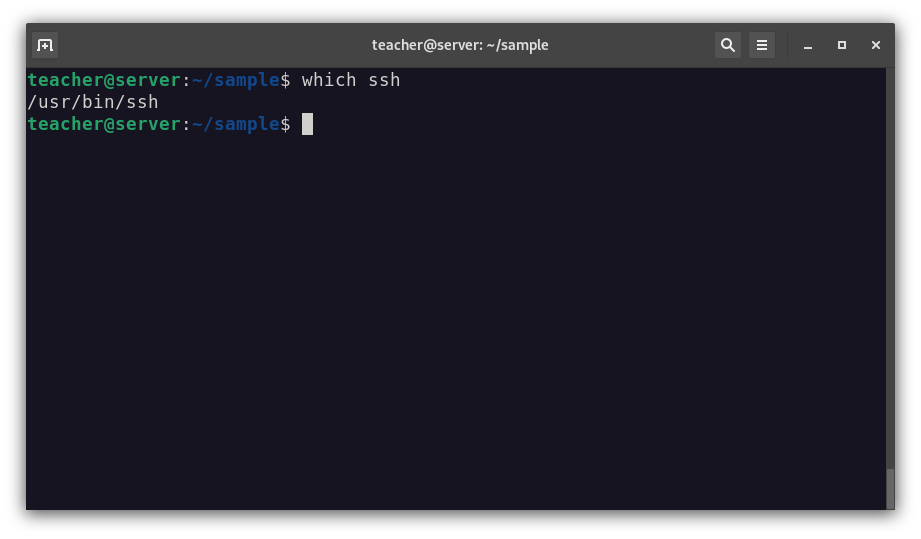
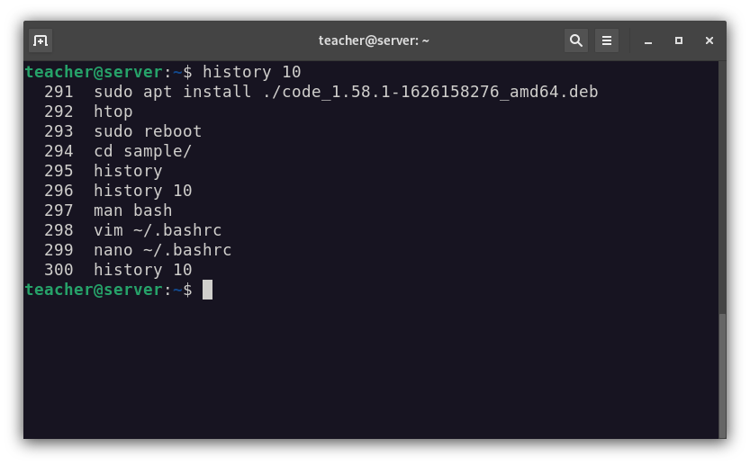
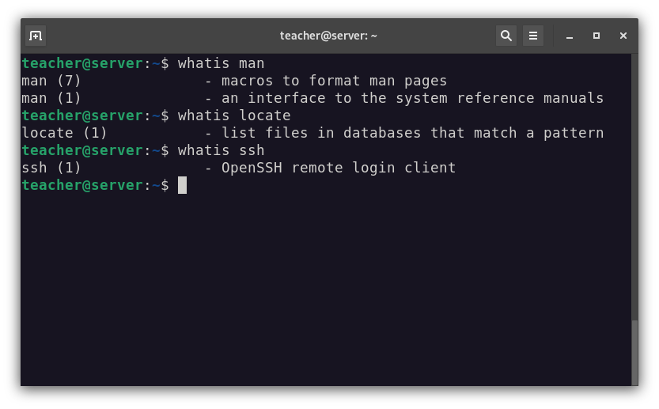

# Command Line Interface (CLI) in GNU/Linux
## *Lecture 3*

## ls - list directory contents

## pwd - print name of current/working directory

## clear - clear the terminal screen

## cd - change directory

## pushd - pushes directories onto a stack
## popd - remove directories from the directory stack

## file — determine file type

## locate - list files in databases that match a pattern

## updatedb - update a file name database

## find - search for files in a directory hierarchy

## which - locate a command

## history - GNU History Library

> HISTSIZE       The number of commands to remember in the command history

> HISTFILESIZE   The number of lines or commands that (a) are allowed in the history file at startup time of a session, and (b) are stored in the history file at the end of your bash session for use in future sessions.

## whatis - display one-line manual page descriptions

## apropos - search the manual page names and descriptions

## man - an interface to the system reference manuals

# Basic file operations

## mkdir - make directories

## touch - change file timestamps

## cp - copy files and directories

## mv - move (rename) files

## rm - remove files or directories

## rmdir - remove empty directories

## echo - display a line of text

## cat - concatenate files and print on the standard output
 

# Redirection & pagers

## more - file perusal filter for crt viewing

## less - opposite of more

 

# File permitions and owner

## chmod - change file mode bits

## chown - change file owner and group

## sudo, sudoedit — execute a command as another user

