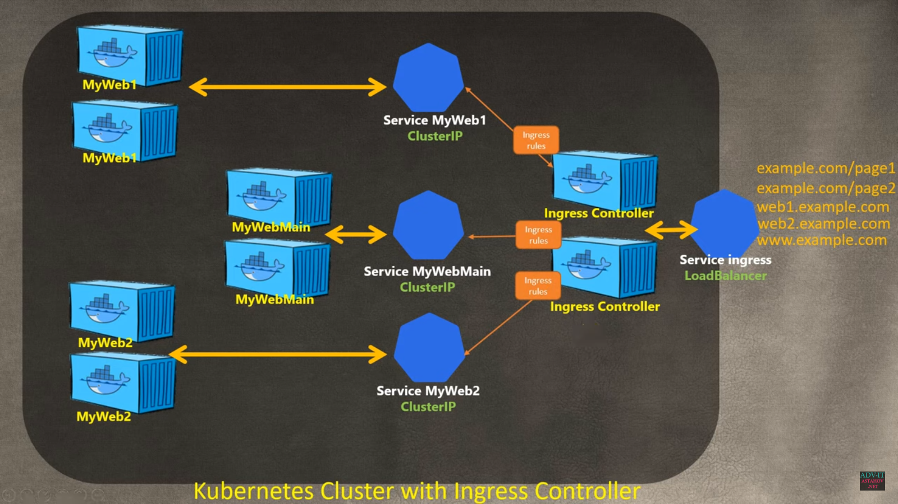
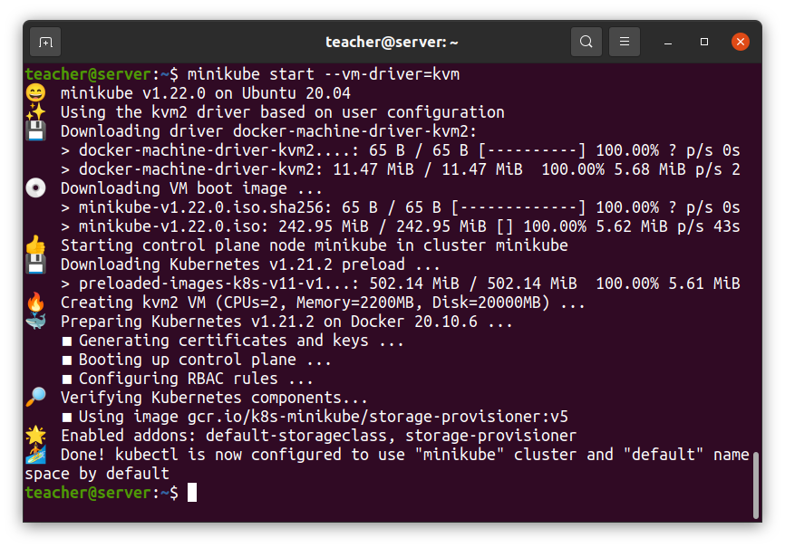

### Structure
* Cluster
* Nodes (Worker Node, Master Node)
* Pod (Container)

* Deployment
* StatefulSet  (for DB)

* Service
* Ingress

* Configmap
* Secret

* Volumes


### Worker machine in K8s cluster
* Kubelet
* Container runtime
* Kube proxy

### Master Node
* Api Server (client gate)
* Scheduler 
* Controller manager (detect cluster events)
* etcd (cluster brain)


## Minikube (one Node cluster)
* worker processes
* master processes


### Basic CMD
```
minikube start --vm-driver=kvm //start k8s cluster
kubectl get nodes		//list of nodes


kubectl run firstpod --generator=run-pod/v1 --image=httpd:latest --port=80
```
### Status cmd
```
minikube status
kubectl get componentstatuses
kubectl cluster-info
```
### Other status cmd
```
kubectl get pod
kubectl get services
kubectl get deployment
kubectl get replicaset
kubectl get all
kubectl get hpa 	//Horizontal Pods Autoscaling
kubectl get rs 	//Replica Set
```
### Create POD (one replica)
```
kubectl create deployment nginx-depl --image=nginx
kubectl edit deployment nginx-depl
```
### Logs, describes and debuging
```
kubectl logs nginx-depl
kubectl describe nginx-depl
kubectl exec -it nginx-depl -- bin/bash  //enter into container
```
### Delete POD
```
kubectl delete deployment nginx-depl
```

## Use commands is inpractical but always use config file
```
kubectl apply  -f [filename].yaml
kubectl delete -f [filename].yaml

kubectl port-forward me-web 1234:80
```
## Work with PODs 
```bash
apiVersion: v1
kind: Pod
metadata:
  name: my-web
  labels:
    env: prod
    app: main
    tier:frontend
    owner: MyName
spec:
  containers:
    - name : container-apache
      image: httpd:latest
      ports:
        - containerPorts: 80

  containers:
    - name : container-tomcat
      image: tomcat:latest
      ports:
        - containerPorts: 8080       
```


## Work with DEPLOYs 
```bash
apiVersion: apps/v1
kind: Deployment
metadata:
  name: nginx-depl
  labels:
    app: nginx
spec:
  replicas: 1
  selector:
    matchLabels:
      app: nginx
  template:
    metadata:
      labels:
        app: nginx
    spec:
      containers:
      - name: nginx
        image: nginx:latest
        ports:
        - containerPort: 80
        
---
apiVersion: autoscaling/v2beta1
kind: HorizontalPodAutoscaler
metadata:
  name: my-autoscaling
spec:
  scaleTargetRef:
    apiVersion: apps/v2beta1v1
    kind: Deployment
    name: nginx-depl
  minReplicas: 2
  maxReplicas: 6
  metrics:
  - type: Resource
    resource:
      name: cpu
      targetAverageUtilization: 70
  - type: Resource
    resource:
      name: memory
      targetAverageUtilization: 80
```

## Work with SERVICEs

### Service Types
* ClusterIP
* NodePort
* ExternalName
* LoadBalancer (only for clouds providers)

### Examples:

https://github.com/adv4000/k8s-lessons/tree/master/Lesson-10-Services


## Basic configuration

### nginx-service.yaml
```bash
apiVersion: v1
kind: Service
metadata:
  name: nginx-service
spec:
  selector:
    app: nginx
  ports:
    - protocol: TCP
      port: 80
      targetPort: 8080
```

### nginx-deployment.yaml

```bash
apiVersion: apps/v1
kind: Deployment
metadata:
  name: nginx-deployment
  labels:
    app: nginx
spec:
  replicas: 2
  selector:
    matchLabels:
      app: nginx
  template:
    metadata:
      labels:
        app: nginx
    spec:
      containers:
      - name: nginx
        image: nginx:1.16
        ports:
        - containerPort: 8080

```


## Ingress Controller



## Install Minikube & Kubectl

* https://minikube.sigs.k8s.io/docs/start/
* https://kubernetes.io/docs/tasks/tools/install-kubectl-linux/


